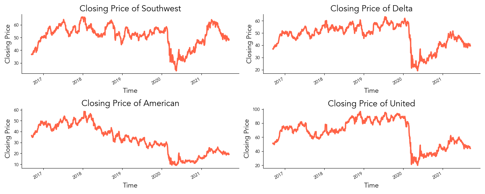

# Airlines Stocks Evaluation 


## Author
* Mia Fryer

## Table of Contents
* [Motivation](#Motivation)
* [Data Sources](#Data_Sources)
* [Feature Engineering/Technical indicators](#Feature_Engineering_Technical_indicators)
* [Data Preparation](#data-preparation)
* [Model Training and Testing](#model-training-and-testing)
* [Analysis](#analysis)
* [Conclusions](#conclusions)
* [Project Structure](#project-structure)

## Motivation
According to the Center for Disease Control and Prevention (CDC), [15.7 out of 1000](https://www.cdc.gov/media/releases/2015/p0225-pneumonia-hospitalizations.html) children are diagnosed with pneumonia in a given year, and [~326K children ages 1-4 in the US died in 2018](https://www.cdc.gov/nchs/data/hus/2019/007-508.pdf) from pneumonia and influenza, the third leading medical-related causes of death. In addition, the Association of American Medical Colleges (AAMC) projected that the shortage of physicians in non-primary and non-surgical specialties (i.e. radiology) can reach up to [42,000 by 2033](https://www.aamc.org/news-insights/press-releases/new-aamc-report-confirms-growing-physician-shortage) in the US. Given that pneumonia is still a prevalent issue and that there may be a shortage of physicians who can diagnose patients, healthcare organizations may experience delays in care.




## Data Sources
ACME Health, one of the largest integrated delivery networks (IDNs) in the US, has recently experienced staffing shortages, especially pulmonologists and radiologists. This shortage has been more evident during the COVID-19 pandemic. They have reached out to our team at AIM Consulting LLC to help develop data analytics and modeling tools to mitigate pain points and delays in their processes. After reviewing ACME Health's workflows, we have determined that one of the best ways our team can help is to develop an image classifier model that can accurately identify pneumonia in the lungs of pediatric patients using chest X-ray images.

## Feature Engineering/Technical indicators

• Moving Average Convergence Divergence (MACD): A momentum indicator which is used to identify trends over time. it is a function of the 12 and 26 day EWMAs.


• Moving Average Convergence Divergence (MACD): A momentum indicator which is used to identify trends over time. it is a function of the 12 and 26 day EWMAs.


• Relative Strength Index (RSI): A momentum oscillator which ranges from 0 to 100. Funds with over 70 or under 30 are traditionally identified as having strong momentum up or down. The RSI is calculated over a period of 14 days, and is a function of relative strength(RS), a ratio of exponentially smoothed moving averages of up and down periods during this time.

• Moving Average Convergence Divergence (MACD): A momentum indicator which is used to identify trends over time. it is a function of the 12 and 26 day EWMAs.


## Data Preparation
The images where first sorted into two folders: pneumonia and normal. The images were then further sorted with a ratio of 60:20:20 in three folders: train, validation, and test. 

We also split the pneumonia images further into bacterial and viral pnuemonia folders, and the split the images into train, validation, and test folders using the same ratio as above.

Using an image data generator, we rescaled each pixel by a factor of 1/255, resized the images to (64,64), and changed images to gray scale. We had a different image data generator for train, validation, and test images. We used the generators and the next() funtion to extract the images and corresponding labels. We further explored the data by spliting the pneumonia files into bacterial and viral infection and repeat the same steps to create generatros for train, test and validation data set. 

## Model Training and Testing
We tested out 6 models in addition to a dummy model:

<ol start="0">
  <li> Dummy Classifier Model (using stratify)</li>
  <li>Baseline Neural Network</li>
  <li>Neural Network with Dense Layers</li>
  <li>Neural Network with Dense and Drop Layers</li>
  <li>Convolutional Neural Network (CNN)</li>
  <li>CNN with Class Weights</li>
  <li>CNN with Focal Loss</li>
</ol>

For model 0, the dummy classifier, with fit the model on the train images and labels, and applied the fitted model to the train data. For models 1-6, we complied and fit the model on the train data, passing in the validation set as well. We used the model to evaluate the test data.


## Analysis
For our analysis, we wanted to focus on the recall metric because we wanted to reduce the number of false negatives or wrongly classifying patients as non-pneumonia when in fact they have pneumonia. In the medical field, the term sensitivity is synonymous to recall.

Our dummy classifier model has a recall of 72%.

As for the other models, the following graph shows the recall metric per model.


We found that model 2 was the best model with the highest recall score. The following is the confusion matrix of model 2.

 


## Conclusions
Given the high recall or sensitivity score, we recommend ACME Health to pilot our binary model with their physicians and compare the model results with the physicians' diagnoses. We believe that the model can help increase pneumonia diagnosis sensitivity, reduce the time it takes to diagnose pneumonia, and allow physicians to reallocate their time into other work. As for the multi-class model, we do not recommend Acme Health to use this model at this time. We would like to do further work on the model and try to obtain more images to improve the model's performance.

## Next Steps
Though our model can aid ACME health to diagnose patients without a physician, this may need to be first approved by health insurers, as some reimbursements require a physician's input. In addition, we would like to test or re-train our models on chest X-ray images of people in other ages groups, especially those who are ages 65+ who may be more prone to infection. Finally, we would like to run similar models to detect other respiratory conditions such as chronic obstructive pulmonary disease.

## Project Structure
```
.
├── 01_Pneumonia_Classifier_EDA.ipynb.
├── 02_Splitting_Image_Files.ipynb 
├── 03_Binary_Modeling.ipynb.  
├── 04_Model_Visualizations.ipynb 
├── 05_Binary_Transfer_Learning.ipynb
├── 06_Multiclass_Modeling.ipynb
├── README.md
├── Pneumonia_X-Ray_Presentation.pdf
├── data
│   ├── BACTERIA
│   ├── NORMAL
│   ├── PNEUMONIA
│   ├── VIRUS
│   ├── split
│   └── split2
├── images
├── models
└── tools
    ├── __init__.py
    ├── misc.py
    └── visualizations.py
```
