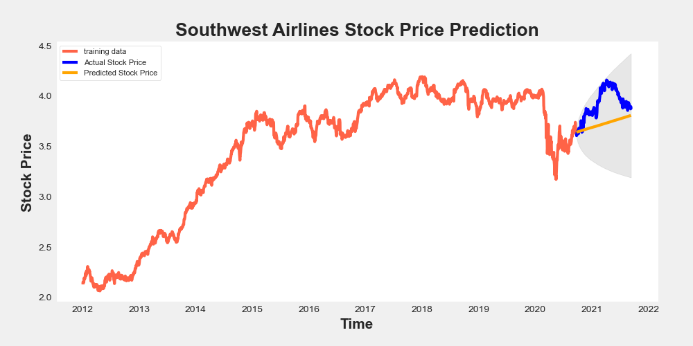

# Airlines Stocks Evaluation 


## Author
* Mia Fryer

## Table of Contents
* [Motivation](#Motivation)
* [Data Sources](#Data_Sources)
* [Feature Engineering/Technical indicators](#Feature_Engineering_Technical_indicators)
* [Data Preparation](#data-preparation)
* [Model Training and Testing](#model-training-and-testing)
* [Analysis](#analysis)
* [Conclusions](#conclusions)
* [Project Structure](#project-structure)

## Motivation
Stock investing without any stratgies can be daunting to decide which to buy. The goal of this project is to bring clarity via a Machine Learning driven dashboard for analyzing and forecasting changes amongst the four major american alines: Southwest, American, Delta and United airlines. Visualizing closing price performance for these airlines at once is a valuable tool for to easily identify trends and do side by side comparison.  Both ARIMA/SARIMA and LSTM neural network produce price forecasts to faciliate investors to make informed investment decisions.


## Data Sources
One of the most important steps in machine learning and predictive modeling is gathering good data. For this project, the data is loaded from Yahoo Finance using pandas DataReader function.

## Feature Engineering/Technical indicators
Financial analysts use a number of technical indicators, the one's including in this project are the following: 

• Moving Average Convergence Divergence (MACD): A momentum indicator to spot increasing short-term momentum using the difference between a short-term(12) and long-term(26 exponential moving average. Generally speaking, when a short-term moving average crossing below a longer-term average is used to illustrate that the asset's price has been moving downward at a faster rate and that it may be a good time to sell. The reverse will also be true for a bullish momemtum and that can be represneted with a positive MACD value. 

• Bollinger Bands: A statistical chart characterizing the prices and volatility over time. The chart is plotted using the moving average of 20 days and two standard deviations of the rolling average as the upper bound and lower bound. A common approach when using Bollinger Bands® is to identify overbought or oversold market conditions. When the price of the asset breaks below the lower band of the Bollinger Bands®, prices have perhaps fallen too much and are due to bounce. On the other hand, when price breaks above the upper band, the market is perhaps overbought and due for a pullback.


• Relative Strength Index (RSI): A momentum oscillator which ranges from 0 to 100. Values of 70 or above indicate that a security is becoming overbought or overvalued and may be due for a corrective pullback in price. An RSI reading of 30 or below indicates an oversold or undervalued condition. The standard is to use 14 periods to calculate the initial RSI value. 


•Simple Risk Evaluation: using daily percentage returns to compare the expected return with the standard deviation of the daily returns as risk.


## Data Preparation
For the regression models (ARIMA, SARIMA), the data was first turned stationary by differencing and taking the log version of the data to remove changing varicance. For the deep learning recurrent neural network models (long hsort term memory), the data was first scaled using the the min max scalar from SKlearn. 

## Model Training and Testing
We tested out many different models using three main predictive machine learning techniques: ARIMA, SARIMA, Exponential Smoothing and LSTM

<ol start="0">
  <li> ARIMA (baseline)</li>
  <li> ARIMA (gridsearch to find optimal paramters)</li>
  <li>SARIMA</li>
  <li>Simple exponential smoothing </li>
  <li>Holt linear smoothing</li>
  <li>Holt-Winter’s seasonal smoothing/li>
  <li>LSTM with single time step</li>
  <li>LSTM with multiple time step</li>
</ol>




## Analysis
For our analysis, we wanted to focus on the recall metric because we wanted to reduce the number of false negatives or wrongly classifying patients as non-pneumonia when in fact they have pneumonia. In the medical field, the term sensitivity is synonymous to recall.

Our dummy classifier model has a recall of 72%.

As for the other models, the following graph shows the recall metric per model.

We found that model 2 was the best model with the highest recall score. The following is the confusion matrix of model 2.


## Conclusions
Given the high recall or sensitivity score, we recommend ACME Health to pilot our binary model with their physicians and compare the model results with the physicians' diagnoses. We believe that the model can help increase pneumonia diagnosis sensitivity, reduce the time it takes to diagnose pneumonia, and allow physicians to reallocate their time into other work. As for the multi-class model, we do not recommend Acme Health to use this model at this time. We would like to do further work on the model and try to obtain more images to improve the model's performance.

## Next Steps
Predicting stock prices using these models is only half of the story. The result will be even more accurate to be used to sentimental analysis on the news for these companies to evaluate if there is an upward trend with more positive news. 

## Project Structure
```
.
├── 01_EDA.ipynb
├── 02_ARIMA_SARIMA.ipynb 
├── 03_Expoential_model.ipynb  
├── 04_LSTM_single_step.ipynb
├── 05_LSTM_multstep.ipynb.ipynb
├── 06_Multiclass_Modeling.ipynb
├── README.md
├── Airline_Stocks_Presentation.pdf
├── gitignore
└── images
 
   
```
